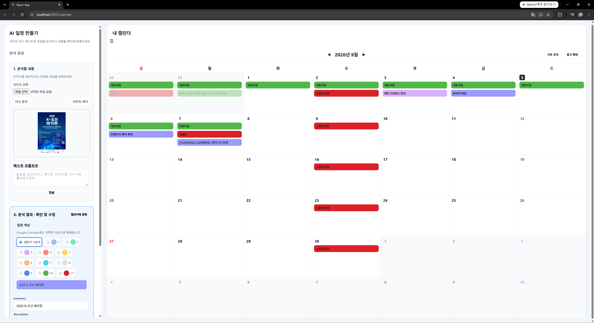
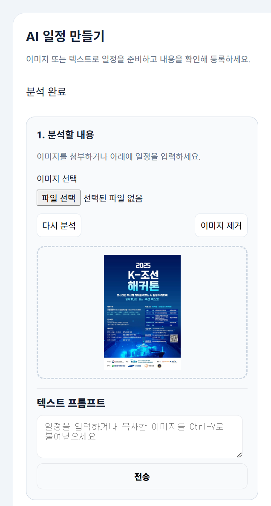
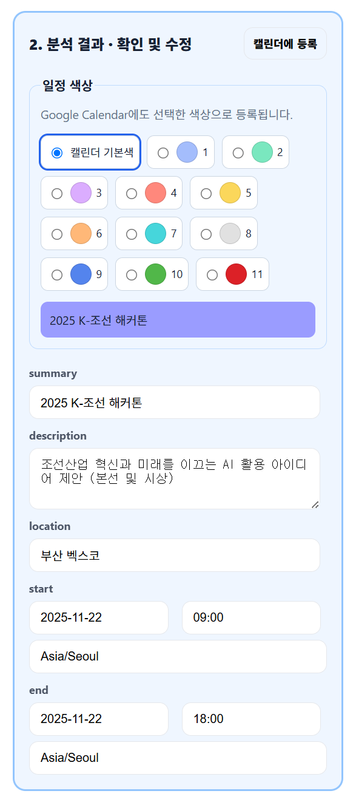

# AI Calendar

**이미지와 텍스트 속 일정을 Gemini로 분석하고, 확인한 내용을 Google Calendar에 등록하는 서비스입니다.** 포스터·안내문·대화 속 날짜와 장소를 캘린더에 일일이 옮겨 적는 번거로움을 줄입니다.

## 주요 기능

- Google OAuth로 기본 캘린더 연결 및 월별 일정 조회
- 이미지 선택·드래그·클립보드 붙여넣기와 자연어 텍스트 분석
- 분석 결과의 제목·설명·장소·시작 및 종료 시간 수정
- 일정 색상 선택과 미리보기, Google Calendar 등록·삭제
- 분석 진행 중 전체 화면 가림막, 오류 안내 및 이미지 재분석
- 분석 기록과 원본 이미지·JSON 조회

이미지 분석과 텍스트 전송은 각각 별도 요청입니다. 이미지와 보충 문구를 함께 분석하는 `/analyze/multi`는 백엔드 API로 제공됩니다.

## 기술 스택과 라이브러리

| 영역 | 기술·패키지 | 역할 |
| --- | --- | --- |
| 프론트엔드 | React 19, React DOM, React Router 7 | 로그인·캘린더 UI와 화면 이동 |
| 실행·빌드 | Node.js, npm, react-scripts 5 | 개발 서버, 번들 생성, Jest 테스트 |
| 서버 | Express 5, cors, dotenv | HTTP API, 교차 출처 요청, 환경 변수 |
| AI | @google/genai | Gemini 이미지·텍스트 분석 |
| 업로드 | multer | 이미지 파일 수신 |
| DB | PostgreSQL, pg | 분석 기록과 이벤트 연결 정보 저장 |
| Google 연동 | Google Identity Services, Calendar REST API | 권한 요청과 일정 조회·등록·삭제 |
| 개발·검증 | nodemon, Testing Library | 서버 자동 재시작과 UI 테스트 |

정확한 버전 범위는 각 앱의 `package.json`, 설치 버전은 `package-lock.json`을 기준으로 합니다. 위 패키지는 `npm install`로 설치되며 개별 설치가 필요 없습니다. Node.js 내장 `fs`, `path`와 브라우저의 `fetch`, IndexedDB는 별도 설치하지 않습니다. 기존 의존성의 `sharp`, `web-vitals`는 현재 실행 코드에서 사용하지 않습니다.

## 설치와 실행

Node.js와 npm, PostgreSQL 서버, Gemini API 키, Google OAuth 웹 클라이언트가 필요합니다. Node.js 버전은 저장소에서 고정하지 않습니다. 아래 명령은 PowerShell 기준이며 저장소 루트에서 시작합니다.

### 1. 백엔드 준비

```powershell
cd gcalendar-api
npm install
New-Item -ItemType Directory -Force uploads/images, uploads/plans
```

`gcalendar-api/.env`를 생성합니다.

```dotenv
PORT=3001
GEMINI_API_KEY=your_gemini_api_key
DB_HOST=localhost
DB_PORT=5432
DB_USER=gcalendar_user
DB_PASSWORD=your_database_password
DB_NAME=gcalendar_db
```

### 2. PostgreSQL 준비

관리자 계정으로 psql에 접속합니다.

```powershell
psql -U postgres
```

psql 안에서는 `cd`를 붙이지 않고 아래 SQL과 접속 명령을 실행합니다. 비밀번호는 `.env`와 일치시키세요. 사용자와 DB가 이미 있다면 생성 단계를 건너뜁니다.

```sql
CREATE USER gcalendar_user WITH PASSWORD 'your_database_password';
CREATE DATABASE gcalendar_db OWNER gcalendar_user;
\connect gcalendar_db gcalendar_user

CREATE TABLE public.logs (
    id bigint GENERATED ALWAYS AS IDENTITY PRIMARY KEY,
    summary text,
    messagepath varchar(255) NOT NULL,
    imagepath varchar(255),
    event_id text,
    created_at timestamp with time zone DEFAULT CURRENT_TIMESTAMP
);
```

테이블은 **postgres DB가 아닌 gcalendar_db**에 생성해야 합니다. 기존 테이블에 컬럼이 부족하면 해당 DB에서 다음을 실행합니다.

```sql
ALTER TABLE public.logs ADD COLUMN IF NOT EXISTS summary text;
ALTER TABLE public.logs ADD COLUMN IF NOT EXISTS event_id text;
SELECT * FROM public.logs LIMIT 10;
```

psql을 종료하려면 `\q`를 입력합니다.

### 3. 백엔드 실행

`gcalendar-api` 폴더에서 실행합니다. 파일 저장 경로가 작업 디렉터리 기준이므로 다른 폴더에서 실행하지 않습니다.

```powershell
npm run dev
```

기본 주소는 `http://localhost:3001`입니다. `npm start`는 자동 재시작 없이 서버를 실행합니다. `/`에는 화면이나 상태 확인 API가 없습니다.

### 4. 클라이언트 준비와 실행

별도 터미널에서 저장소 루트 기준으로 실행합니다.

```powershell
cd g_calendar-client
npm install
Copy-Item .env.example .env
```

기존 `.env`가 있으면 복사로 덮어쓰지 말고 필요한 값만 수정합니다.

```dotenv
REACT_APP_GOOGLE_CLIENT_ID=your_client_id.apps.googleusercontent.com
REACT_APP_API_BASE_URL=http://localhost:3001
```

```powershell
npm start
```

`http://localhost:3000/login`에 접속합니다. 환경 변수를 변경하면 개발 서버를 재시작해야 합니다. 종료는 각 터미널에서 `Ctrl + C`입니다. **현재 클라이언트 폴더명은 g_calendar-client**입니다.

`REACT_APP_*`는 브라우저 번들에 포함되는 공개 설정입니다. OAuth 클라이언트 ID는 공개 식별자이며, Gemini 키·Google client secret·DB 비밀번호는 백엔드에만 보관합니다.

## Google 연결 설정

1. Google Cloud에서 OAuth 클라이언트가 속한 프로젝트를 선택하고 **Google Calendar API를 활성화**합니다.
2. Google 인증 플랫폼에서 동의 화면을 구성합니다. 개인 Gmail로 개발할 때는 외부 사용자와 테스트 상태를 사용합니다.
3. 웹 애플리케이션 클라이언트의 **승인된 JavaScript 원본**에 `http://localhost`와 `http://localhost:3000`을 추가합니다. `/login` 같은 경로는 붙이지 않습니다.
4. 해당 클라이언트 ID를 클라이언트 `.env`에 넣습니다.
5. **대상(Audience) → 테스트 사용자**에서 실제 연결할 Google 계정을 추가합니다.
6. 데이터 액세스에 아래 범위를 등록하고 앱에서 권한을 승인합니다. 현재 코드도 이 두 범위를 요청합니다.

```text
https://www.googleapis.com/auth/calendar.readonly
https://www.googleapis.com/auth/calendar.events.owned
```

현재 연결은 팝업 토큰 방식입니다. 도메인 배포 시 실제 HTTPS 원본과 승인된 도메인을 등록해야 합니다. 설정 참고: [Google OAuth 설정](https://developers.google.com/identity/oauth2/web/guides/get-google-api-clientid), [테스트 사용자](https://support.google.com/cloud/answer/15549945?hl=ko), [Calendar 권한](https://developers.google.com/workspace/calendar/api/auth).

권한을 변경했는데 이전 토큰이 남아 있다면 앱의 개발자 도구 Console에서 다음을 실행하고 다시 승인합니다.

```javascript
sessionStorage.removeItem("google_access_token");
location.href = "/login";
```

## 사용법

### 1. Google 캘린더 연결과 전체 화면

클라이언트와 백엔드를 실행한 뒤 `http://localhost:3000/login`에서 **Google 캘린더 연결**을 선택하고 권한을 승인합니다. 테스트 모드에서는 개발자가 등록한 테스트 계정으로 연결해야 합니다.

화면 왼쪽은 **AI 일정 만들기**, 오른쪽은 **내 캘린더**입니다. 왼쪽에서 입력과 분석 결과를 확인하고, 오른쪽에서 등록된 일정을 확인합니다. `☰` 버튼으로 입력 패널을 접거나 펼치고, 월 표시 양옆의 화살표로 이전·다음 달을 이동할 수 있습니다.



### 2. 이미지 또는 텍스트 입력

**1. 분석할 내용** 영역에서 다음 방법 중 하나를 사용합니다.

- **파일 선택**: 포스터나 안내문 이미지 파일을 선택합니다.
- **드래그 앤 드롭**: 이미지 파일을 점선 영역으로 끌어 놓습니다.
- **이미지 붙여넣기**: 이미지를 복사한 뒤 텍스트 프롬프트 또는 점선 영역에서 `Ctrl + V`를 누릅니다.
- **텍스트 입력**: 날짜, 시간, 장소가 담긴 문장을 텍스트 프롬프트에 입력하고 **전송**을 누릅니다.

이미지를 첨부하면 자동으로 분석을 시작합니다. **다시 분석**은 현재 이미지를 재분석하고, **이미지 제거**는 화면에 첨부된 이미지를 제거합니다. 이미지 제거는 서버의 기존 분석 기록이나 이미 등록한 일정을 삭제하는 기능이 아닙니다.

예시 입력: `2026년 9월 10일 오후 2시부터 3시까지 서울에서 팀 회의`

현재 화면의 이미지 분석과 텍스트 전송은 각각 별도로 처리됩니다. 텍스트 전송이 첨부 이미지와 함께 분석되는 것은 아닙니다.



### 3. 분석 결과 확인과 일정 등록

분석 중에는 전체 화면이 반투명 가림막으로 덮이고 진행 안내가 표시됩니다. 완료 후 파란색 **2. 분석 결과 · 확인 및 수정** 영역에서 추출된 내용을 확인합니다. 왼쪽 패널을 아래로 스크롤하면 결과 입력란을 모두 볼 수 있습니다.

| 화면 항목 | 확인할 내용 |
| --- | --- |
| `summary` | 일정 제목 |
| `description` | 일정 설명 |
| `location` | 장소 |
| `start` | 시작 날짜, 시간, 시간대 |
| `end` | 종료 날짜, 시간, 시간대 |
| 일정 색상 | 캘린더 기본색 또는 제공되는 색상 중 선택 |

날짜와 시간을 확인하고 필요한 내용을 수정합니다. 색상을 선택하면 제목 미리보기에 반영됩니다. **캘린더에 등록**을 누르면 Google Calendar의 기본 캘린더에 등록 요청을 보내며 선택한 색상도 함께 전달합니다. 등록한 일정의 달로 이동해 결과를 확인하세요. 스크린샷의 예시 일정은 2025년 11월이며 전체 화면의 표시 월과 다릅니다.



### 4. 자동 등록과 오류 처리

- **자동 등록**을 켜면 분석 후 별도의 확인 버튼 없이 등록을 진행합니다. 분석 결과를 먼저 검토하려면 꺼두세요. 색상을 지정해 자동 등록하려면 분석 전에 선택합니다.
- 분석 실패 시 오류 안내를 확인하고 입력 내용을 보완해 다시 전송하거나 **다시 분석**을 누릅니다. 입력값은 유지됩니다.
- 분석이 90초를 넘으면 시간 초과를 안내하고 화면 조작이 다시 가능해집니다.
- Google API의 권한 오류가 발생하면 OAuth 설정과 승인된 권한을 확인합니다. DB·연결 오류는 아래 설치 및 문제 해결 안내를 참고하세요.
- **로그 확인**에서 분석 기록을 볼 수 있습니다. 로그 전체 삭제는 서버의 전체 로그와 연결된 파일을 대상으로 합니다.

## 구조와 API

```text
.
├── docs/screenshots/             # 사용 가이드 이미지
├── g_calendar-client/
│   ├── .env.example              # 공개 설정 예시
│   ├── public/                  # HTML과 정적 파일
│   └── src/
│       ├── App.js               # 화면 라우팅
│       ├── LoginPage.js         # Google 연결
│       ├── CalendarPage.js      # 분석·결과·캘린더 UI
│       ├── CalendarWorkspace.css
│       └── config.js            # 백엔드 주소 설정
└── gcalendar-api/
    ├── index.js                 # Express 서버
    ├── router/analyzer.js       # 분석 및 기록 API
    ├── db/db.js                 # PostgreSQL 연결
    ├── index.html               # 이미지 API 수동 테스트
    └── uploads/                 # 이미지와 결과 JSON, Git 제외
```

| 메서드 | 경로 | 기능 |
| --- | --- | --- |
| POST | `/analyze/image` | multipart `image` 분석 |
| POST | `/analyze/text` | JSON `text` 분석 |
| POST | `/analyze/multi` | multipart `image`와 선택 `prompt` 분석 |
| GET | `/analyze/logs` | 최근 분석 기록 |
| PATCH | `/analyze/logs/:id/event` | JSON `eventId`를 기록에 연결 |
| GET | `/analyze/logs/by-event/:eventId` | 이벤트에 연결된 기록 |
| GET | `/analyze/logs/:id/raw` | 원본 결과와 이미지 경로 |
| DELETE | `/analyze/logs` | 전체 기록과 연결 파일 삭제 |

분석 API는 JSON 파일 저장과 DB 삽입 후 `{ success, message, logId }`를 반환합니다. 클라이언트는 날짜·시간을 Google 형식으로 변환해 Google Calendar에 직접 등록합니다. `/uploads`는 저장 파일의 정적 제공 경로입니다. [API 요청 예시](gcalendar-api/README.md)

## 문제 해결

| 증상 | 확인할 사항 |
| --- | --- |
| 승인된 테스터만 접근 가능, access_denied | 현재 OAuth 프로젝트에 로그인 계정을 테스트 사용자로 추가 |
| Google 조회·등록 요청 403 | Calendar API 활성화, 실제 승인된 권한 확인. Network의 Response 오류 사유 확인 |
| logs 릴레이션이 없음 | `.env`의 DB에 접속했는지 확인하고 그 DB에 테이블 생성 |
| summary 또는 event_id 컬럼 없음 | 위 ALTER TABLE 실행 |
| DB 권한 오류 | `.env`의 사용자가 테이블을 소유하거나 필요한 권한을 갖는지 확인 |
| 이미지 업로드 ENOENT | API 폴더에서 실행하고 uploads/images 폴더 생성 |
| 분석 연결 실패 | 백엔드 실행, 클라이언트 API 주소와 포트 확인 |
| AI 사용 한도·시간 초과 | API 사용량 확인 후 재시도 |

## 검증과 현재 제한

클라이언트 폴더에서 실행합니다.

```powershell
npm test -- --watchAll=false
npm run build
```

테스트는 Google 연결 화면의 오류 복구와 기존 토큰에 따른 이동을 확인합니다. 실제 Google·Gemini·PostgreSQL 연동 테스트는 별도로 필요합니다. 백엔드에는 자동 테스트 스크립트가 없습니다.

현재 구현에서 보완할 부분:

- 백엔드 API 인증과 사용자별 로그 분리가 없습니다. 전체 삭제는 모든 사용자의 기록을 대상으로 합니다.
- 업로드 크기·파일 형식 제한과 요청 횟수 제한이 없고 CORS는 전체 허용입니다.
- 파일 저장과 DB 기록은 하나의 트랜잭션이 아니므로 실패 시 파일이 남을 수 있습니다.
- AI 결과의 날짜·시간 검증과 시간대 변환은 추가 보완이 필요합니다. 등록 시 입력값을 확인하세요.
- 자동 등록은 결과 검토를 생략합니다. 오류·시간 초과 후에는 실제 캘린더를 확인해 중복 등록을 피하세요.
- 캘린더 화면에 일부 React Hook 의존성 경고가 남아 있습니다.

## Git 관리와 라이선스

각 앱의 `package.json`, `package-lock.json`과 `.env.example`은 공유합니다. `node_modules`, `.env`, 업로드 파일과 빌드 결과는 제외합니다. npm 명령은 루트가 아닌 각 앱 폴더에서 실행합니다.

루트 [LICENSE](LICENSE)는 MIT입니다. 백엔드 package.json의 ISC 표기는 라이선스 파일과 불일치하므로 배포 전 프로젝트 소유자의 확인이 필요합니다.
